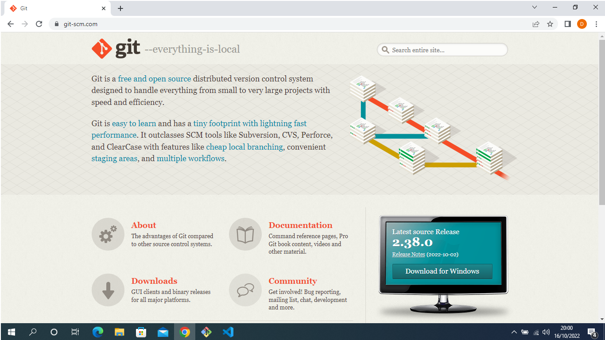
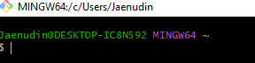

## tugas1

# tugas bahasa pemrogaman

## download git
membuka website resmi git (git-scm.com), lalu diinstal sesuai leptop yang digunakan


## membuat git bash
setelah itu membuka git bash


## membuat global config
pada saat pertama kali menggunakan git, kita perlu melakukan konfigurasi user,name dan user.email., konfigurasi ini bisa dilakukan untuk global repostiriy atau individual repository atau individual repository. bila belum dilakukan konfigurasi,akan menakibatkan terjadinya kegagalan saat menjalankan perintah git commit
config global repository
```
$ git config --global user.name "nama_user"
$ git config --global user.email "nama_email"
```

## membuat repository local
buat direktory projec praktikum pertama dengan nama tugas1
```
$ mkdir tugas1
$ cd tugas1
```
sehingga terbentuk satu direktori baru dibawahnya,selanjutnya masuk kedalam direktori tersebut dengan perintah cd (change directory)

jalankan perintah git init,untuk membuat repository local.
```
$ git init
```

## menambahkan file baru pada repository
disini kita akan mencoba buat satu file bernama README.md(text file)
```
$ echo "# tugas 1" >> README.md
```
untuk menambahkan file yang baru saja di buat tersebut gunakan perintah gut add.
```
$ git add README.md
```

## menyimpan perubahanke database
untuk menyimpan perubahan yang ada ke dalam database repository local,gunakan perintah :
```
$ git commit -m "simpan"
```

## membuat repository server
anda harus membuat akun di github terlebih dahulu
pada halaman github,klik tombol start a prooject atau
darimnu (icon +) klik new repository
![gambar]

isi nama repositorynya, misal:tugas1
lalu klik tombol create repository
![gambar]

## menambahkan remote repository
gunakan perintah :
```
$ git remote add origin [url]
```

## mengirim perubahan keserver (push)
untuk mengirim perubahan pada local repository ke server gunakan perintah git push.
``` 
$ git push -u origin master
```
## melihat hasil pada server repository
untuk buka halaman github.com,arahkan pada repositorynya

## clone repository
pada dasarnya mengcopy repository server dan secara otomatis mebuat satu direktory sesuai dengan nama repositorynya (working directory)
untuk melakukan cloning,gunakan perintah :
```
$ git clone [url]
```

